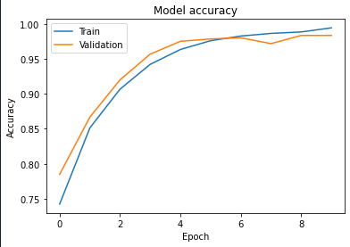

# MINDMAPPER: INVESTIGATING BRAIN TUMORS THROUGH CNN TECHNIQUES

## Abstract
Brain tumors pose significant health challenges, necessitating early diagnosis and effective treatment. This project leverages Convolutional Neural Networks (CNNs) to analyze MRI and CT scans for automatic brain tumor detection, achieving an accuracy of 98%. The goal is to improve diagnostic accuracy and efficiency.

## Features
- **High accuracy** in brain tumor detection from MRI/CT scans using CNN-based models.
- **Real-time tumor detection** in MRI images.
- **Preprocessing** techniques like resizing, normalization, and augmentation to improve model performance.
- **Visualization** of training and validation accuracy, loss, and model performance metrics.

## Methodology

### Data Collection
- **Dataset:** MRI/CT scan images of the brain, including both tumor-present and tumor-absent images.

### Data Preprocessing
- **Resizing** images to fit the model's input size.
- **Normalization** and **augmentation** to improve the model’s generalization and performance.

### Model Architecture
The architecture uses a Convolutional Neural Network (CNN) model with the following layers:
1. **Conv2D** for convolution operations.
2. **MaxPooling2D** for down-sampling.
3. **Dropout** to prevent overfitting.
4. **Dense** layers for classification.
5. **ReLU** activation function for non-linearity.
6. **Sigmoid** activation function for binary classification (tumor present or absent).

# IV. RESULTS AND DISCUSSIONS

The new method for finding brain tumors using deep learning with CNNs achieved better results compared to the old one. The old method had 97% accuracy, but the new approach reached 98% accuracy, just by using CNNs. This improvement highlights how even small changes in model configuration or data preprocessing can significantly affect performance. The higher accuracy in the new method suggests that the adjustments made in model learning or data preparation contributed to better results. The increase in accuracy might also be attributed to the model being trained for 50 epochs in the new method, compared to the old method, which could have had fewer training rounds.

*Representation of the increase in model accuracy using proposed approaches.*

In conclusion, the new method for brain tumor detection using CNNs performs better than the older method due to fine-tuning of model parameters and data preprocessing. The extended training period (50 epochs) contributed to a more refined model capable of achieving 98% accuracy compared to the 97% accuracy of the old method. These enhancements show how small adjustments can have a significant impact on medical imaging tasks like tumor detection.

---

**Fig 4:** Training and Validation Accuracy of a CNN Model

This graph displays the accuracy of the CNN model during training and validation. The x-axis represents the epoch, which is one complete pass through the training data, while the y-axis shows the accuracy, indicating how well the model performs on the given dataset. The two lines on the graph represent:
- **Training Accuracy:** The model's performance on the training data, which is usually higher.
- **Validation Accuracy:** The performance on unseen data, providing a more realistic estimate of the model's performance.

---

# V. CONCLUSION AND FUTURE SCOPE

In summary, the use of convolutional neural networks (CNN) for detecting brain tumors has shown an impressive accuracy of up to 98%, making it highly effective for identifying and classifying brain tumors from MRI and CT scans. This capability aids doctors in diagnosing and treating patients more efficiently. 

As we continue to refine these methods and explore different types of data analysis, we can expect even better results, leading to earlier diagnosis of brain diseases and better patient care. CNNs hold substantial potential for advancing the detection of brain tumors in the future. With continuous improvements in medical imaging technologies and the availability of more data for training, CNNs will become increasingly proficient in identifying and classifying brain tumors from MRI or CT scans. Scientists are also working on making these models more accessible to healthcare professionals, enabling them to better understand tumors and their behavior.

Moreover, by combining various imaging data, we can create models tailored to individual patients, enhancing early detection of brain tumors and ensuring more accurate diagnoses. Consequently, using deep learning techniques like CNNs for brain tumor detection will profoundly impact how we treat brain cancer and improve patients' lives.

---

## References

- [Insert reference details here, if any]
